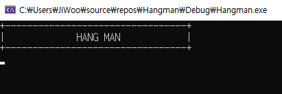
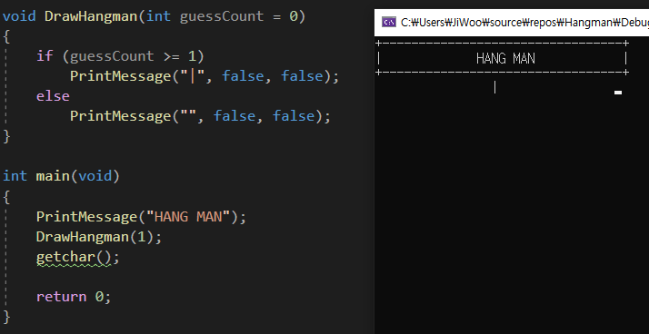
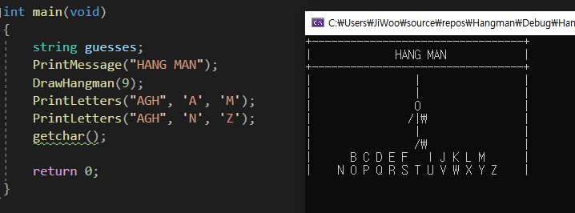
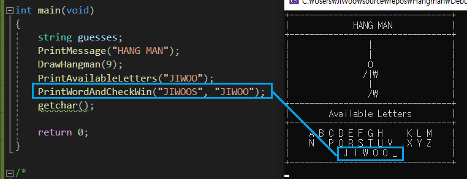

# Hangman_game
 
## 컴퓨터공학 포토폴리오 김지우


위의 영상을 보면 사람 팔 한부분이 \가 나와야하는데 won단위표시로 나옵니다. window가 한글이라 그렇다고 합니다. 찾아본 바로는 수정할 방법이 없었습니다.

**간단한 C++ 연습용 게임 만들기**

## Code 설명

### 출력문 logic >  
하나의 출력 wrapper function을 만들어 위, 아래 경계와, 양쪽여백을 한번에 control가능한 함수를 만들어 활용하였습니다.
```C
// 위, 아래 border는 기본으로 true입니다. 사용하지 않고싶다면 flase를 넘겨주면됩니다.
void PrintMessage(string message, bool printTop = true, bool printBottom = true)
{
    if (printTop) // 위쪽 경계를 만들고 싶다면, printTop = true 인해 조건문 안을 실행
    {
        cout << "+---------------------------------+" << endl; // 총 33글자
        cout << "|"; // 메세지 시작지점 
    }
    else { //  printTop = flase 인 경우 그냥 왠쪽 경계만 출력
        cout << "|";
    }
    bool front = true; // flag 초기화
    for (int i = message.length(); i < 33; i++) // 33은 위의 ----의 갯수 
    {
        if (front) // front라면 빈공간과 message 출력 
        {
            message = " " + message;
        }
        else { // back이라면 message먼저 출력후 빈공간
            message = message + " ";
        }
        front = !front;
    }
    cout << message.c_str(); // message 출력
    if (printBottom)
    {
        cout << "|" << endl; // 오른쪽 경계면 출력 
        cout << "+---------------------------------+" << endl; // 하단부 경계 출력
    }
    else {
        cout << "|" << endl;
    }
}
```
**결 과**



### DrawHangman logic >
반복부분 생략
```C
void DrawHangman(int guessCount = 0)
{
    if (guessCount >= 1)
        PrintMessage("|", false, false);
    else
        PrintMessage("", false, false);

    ... 중략

    if (guessCount == 4) // 딱 4일때만, 몸체는 / -> /| -> /|\ 순으로 그려야 해서 
        PrintMessage("/  ", false, false); // else는 없음 빈공간은 출력하고싶지 않음

    if (guessCount == 5) // 딱 5 일때만 
        PrintMessage("/| ", false, false); // else는 없음 빈공간은 출력하고싶지 않음

    if (guessCount >= 6) // 6아상부터는 몸체 다 보여줌 
        PrintMessage("/|\\", false, false); // escape문자 조심 
    else
        PrintMessage("", false, false);

    ... 중략

    if (guessCount >= 9) // 9아상부터는 몸체 다 보여줌 
        PrintMessage("/\\", false, false); // escape문자 조심 
    else
        PrintMessage("", false, false);

}
```
guessCount가 늘어감에 따라 사람이 완성되가는 모습으로 출력.

**결 과**



### PrintLetters logic >

해당 character가 정답안에 있는지 확인하는 함수   
string::npos 는 find가 찾는문자열이 없을경우 반환함

```C
void PrintLetters(string input, char from, char to)
{
    string s;
    for (char i = from; i <= to; i++) // from부터 to까지 반복
    {
        if (input.find(i) == string::npos) // 만약 input이 current character를 갖고있지 않다면
        { // 찾지못한 character
            s += i;
            s += " ";
        }
        else {
            s += "  "; // 이미찾은 character는 빈공간으로 출력 
        }
    }
    PrintMessage(s, false, false);
}
```
**결 과**



입력했던 단어는 빈칸으로 출력, 남은 단어만 


### PrintWordAndCheck >

반환값으로는 bool로써 character가 맞다면 true, 아니면 false 반환
```C
bool PrintWordAndCheckWin(string word, string guessed) // guess아님  guessed 맞음 
{
    bool won = true; // 기본값 true
    string s;
    for (int i(0); i < word.length(); i++) // 단어 길이만큼 반복
    {
        if (guessed.find(word[i]) == string::npos)
        { // 찾지 못했다면 
            won = false;
            s += "_ "; // 틀린 character는 보여주지 않고 placeholder로 출력 
        }
        else {
            s += word[i]; // 맞춘 character는 출력 
            s += " ";
        }
    }
    PrintMessage(s, false); // 위쪽경계없이 출력

    return won;  // bool값 반환
}
```
**결 과**


